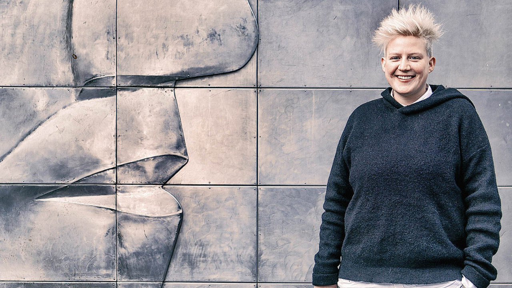
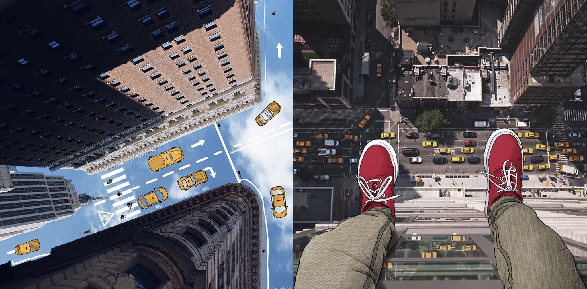
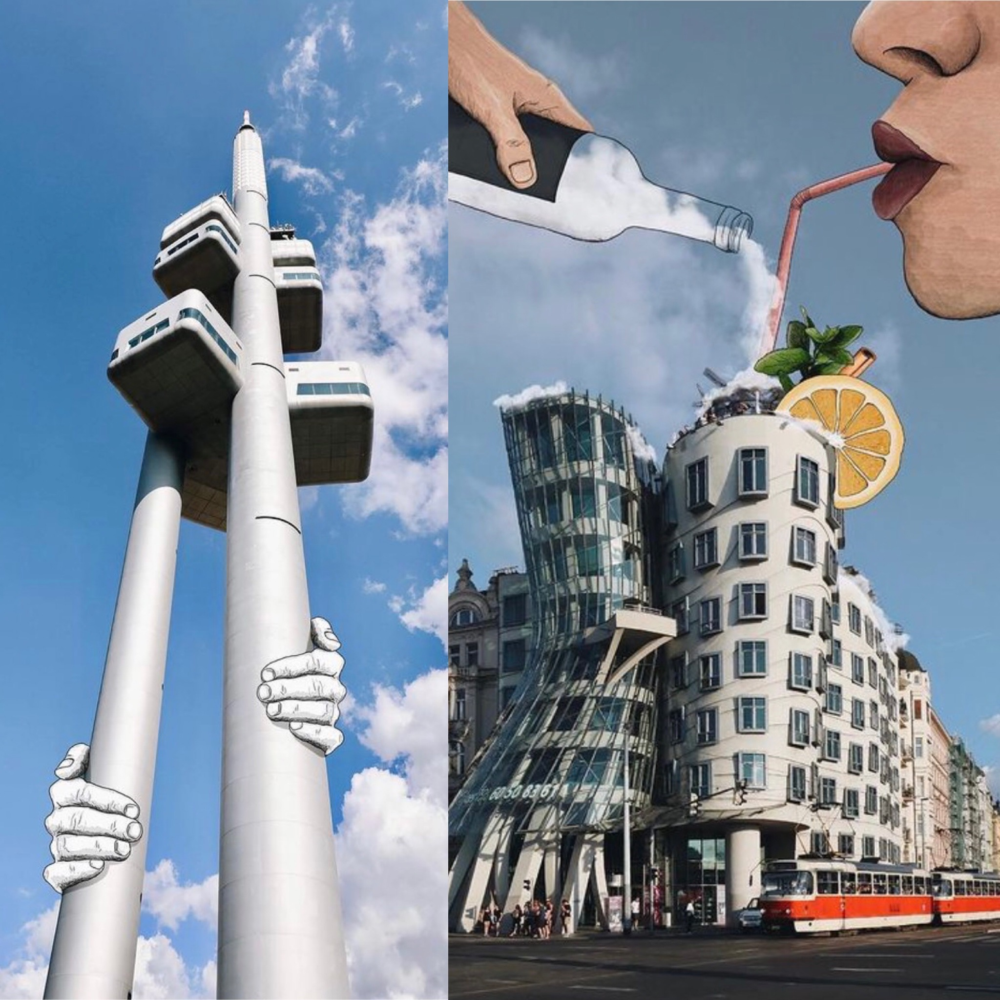
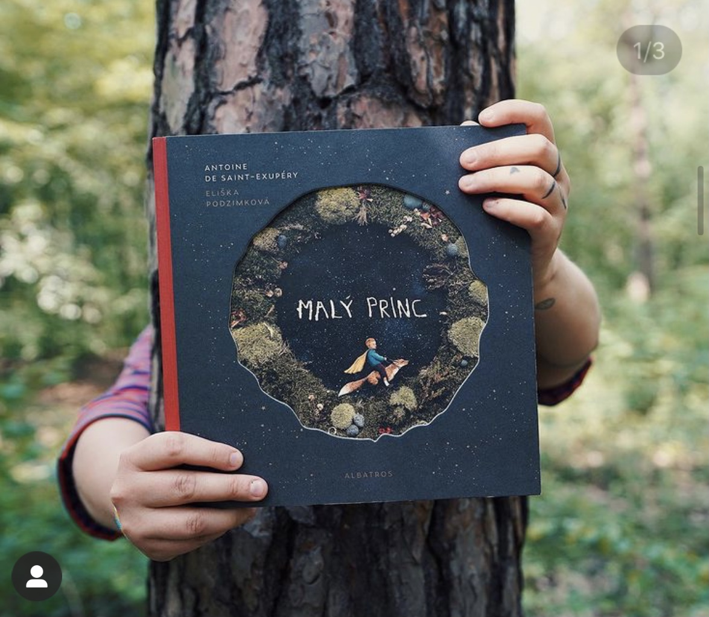
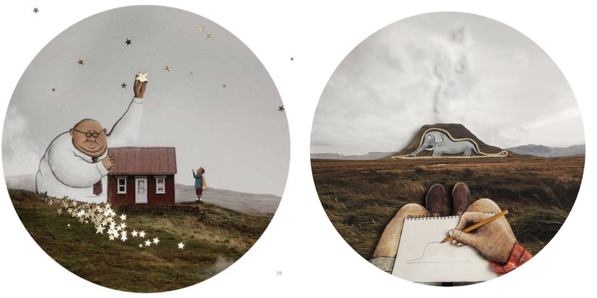
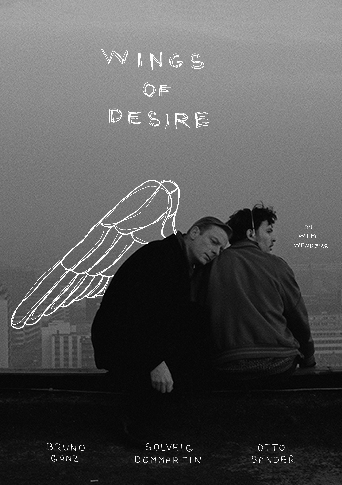
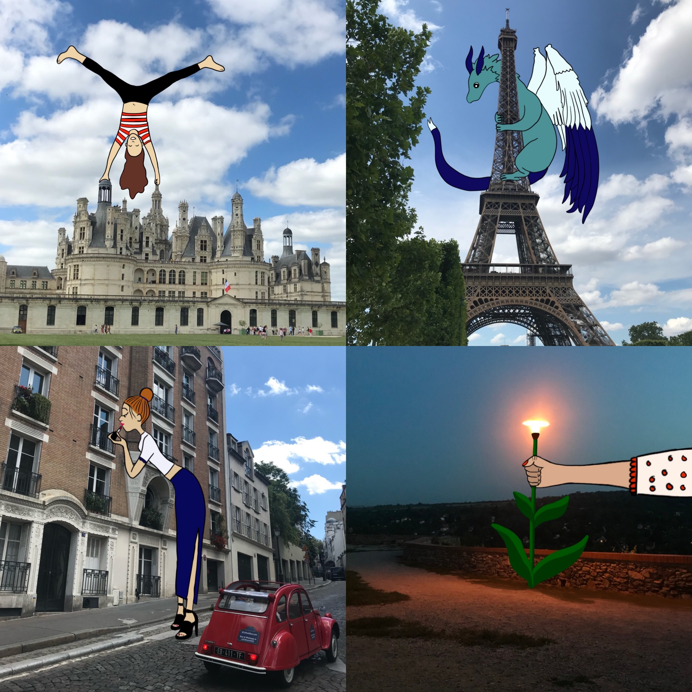

# Me and illustrations
I would like to tell you something more about Me and Illustrations, First I am going to speak about one of my favorite illustrators Eliška Podzimková and next I am going to show you my illustrations and then tell you something more about my artworks.
## Who is Eliška Podzimková? 

- illustrator - she creates a specific illustration and has a unique style.
- animator - she makes beautiful hand-drawn animations, short films with her illustrations.
- digital artist - she works with photos and illustrations and combinations with them.

Eliska Podzimkova is a young artist from Prague. She is a creative multimedia artist whose unique wit, a strong sense of design, and technical skill have all contributed to her international reputation as a pioneering animator, illustrator, and digital artist. Her unusual technique of blending live-action photography and video with humorous yet emotionally hand-drawn animation is universally appealing across genres and borders alike. Whether applying her art to award-winning short films, music videos, collaborative photography projects, or marketing campaigns for such clients as Jamie Oliver, Vogue Magazine, New York Film Academy, and many others.

## Why is Eliska one of my favorite illustrators?
I gotta admire her talent. She has incredible imaginations with her illustrations. She is a very powerful woman. When she was 16 years old, doctors diagnosed her with cancer. Fortunately, Eliška never admitted that it could go wrong. She makes life so nice for her. She is a person, who makes you laugh and awakens in you the feeling that it is never the right time to give up anything…
As she says: 
I am ready to enjoy every day as best I can.
And nowadays she is a world-famous illustrator. 

## Eliska Podzimkova's artworks
### Animate NY
AnimateNY was one of the first projects and also probably one of the most important. After getting back from New York in 2012 she started looking for pictures from this city. She had this need of putting something from her into them so she started drawing. 
She collaborated with many Instagrammers from NY and edited their photos. Her Instagram account started growing and all of a sudden she started getting big offers for example from Jamie Oliver or the New York Film Academy. She moved to NYC and lived there for over a year. It opened her mind and now she “animate” other places than New York too. For example Prague. 

NYC

Prague (Zizkov TV tower and The dancing house)

### The book: The little prince

My favorite project is the book The Little Prince, which Eliška illustrated. Here again, she uses a combination of photos she took in Iceland together with her illustrations. She added interactive drawings to the book, which you scan by Artivive application, and the illustrations become short animations, so the story of the little prince comes to life.

## Who am I?
- A student of graphic and media design
- A person, who obsessed with precision and simplicity
- Designer, who lives in the universe inside his head
- A Lover of illustrations
- And a big bookworm!

### How Eliška influenced my work?
I started watching Eliška on Instagram about a year ago. I liked her work, it was specific and fun. Thanks to her, I started to embark more on illustrations and create various experiments with a sense of humor. And I also started doing animation. 

## My works 
### Never-ending calendar

There are two of twelve watercolor illustrations for my never-ending calendar, which I sell in my mummy’s cafe. 

### Movie Poster - Wings of desire 

### Inspiration by Eliska

### Happy Holidays 

