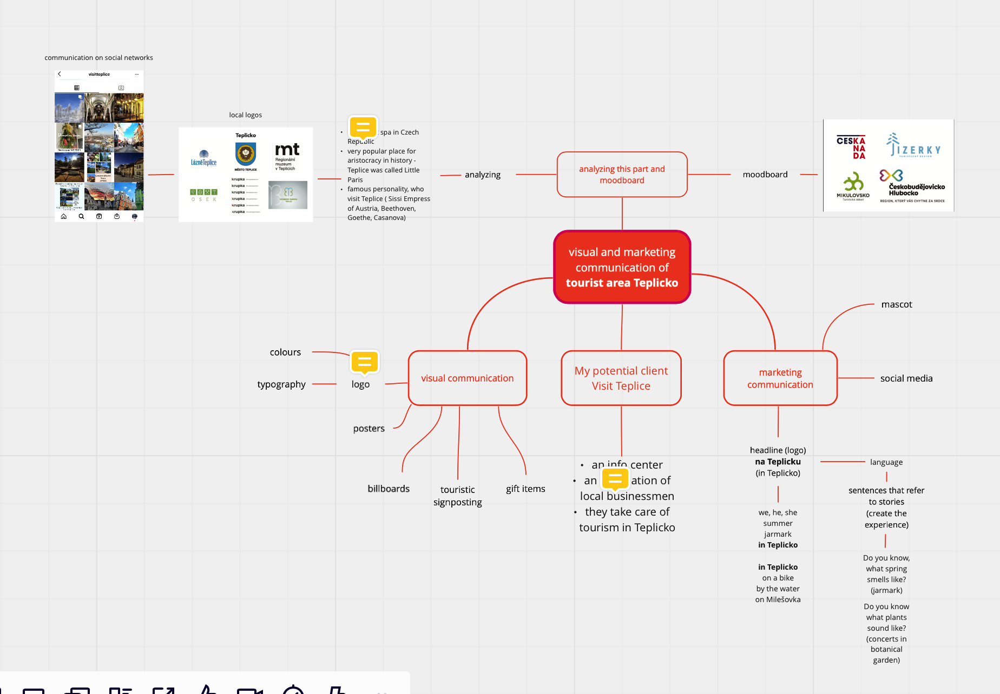

## Visual and marketing communication of tourist area Teplicko

This bachelor's thesis is about creating new visual and marketing communication of tourist area Teplicko. It is located north of Bohemia (near my hometown Ústí nad Labem). This area offers a variety of activities (spa, mountains, parks, lakes, sights). It is suitable for walking, cycling or sightseeing. The goals are to lure new tourists, get to the top 10 in Ústecký regio. Create a design that refers to stories, which you can experience in Teplice like popular characters (Sisi or Beethoven) and which activities you can do here.

### Voice & Tone

Voice - personal, inspiring, professional

Tone - friendly, motivated, possitive

  
Mind Map

### Outline

- Teplicko is suitable for everyone (young people, families with children, adults, or seniors).
- This area offers a variety of activities for tourists.
- There is good infrastructure (lots of hotels, restaurants, cafes)
- Design of the logo symbolizes paths and colors are chosen as tourist sight posts.
- The main target group is young people and families with children.
- In this project, I mainly focused on visual identity and communication through posters, social media, and items gifts.
- Marketing communication is based on own language and mascot (a pig) for children.

### Keywords

- marketing communication
- visual identity
- graphic design
- logo design
- social media
- slogans
- mascot

### References

[Lipno nad Vltavou](https://www.lipno.info)

[Znojmo city](https://www.instagram.com/znojmocity.cz/)
