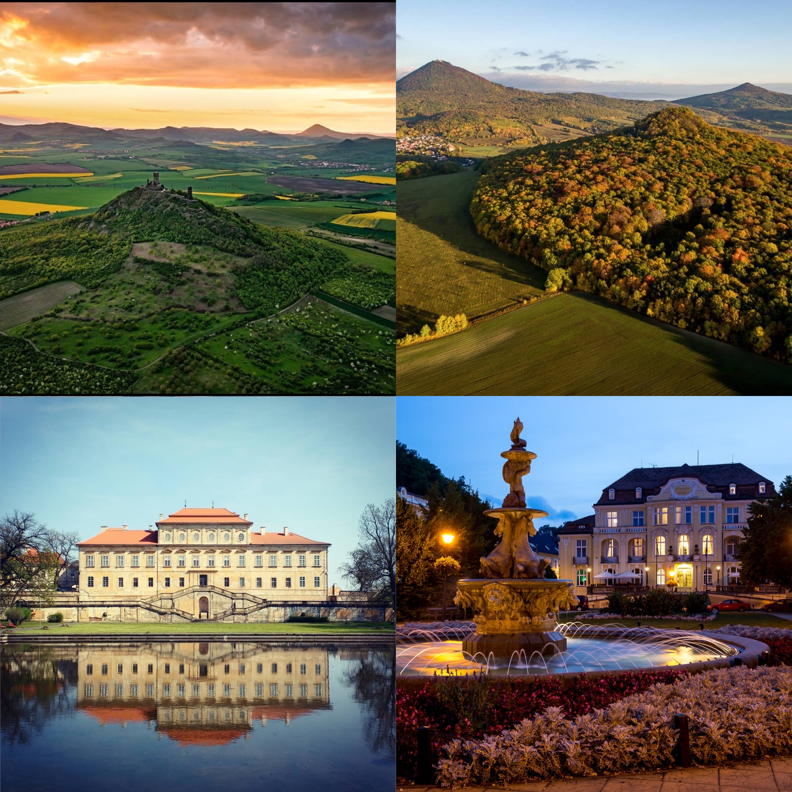
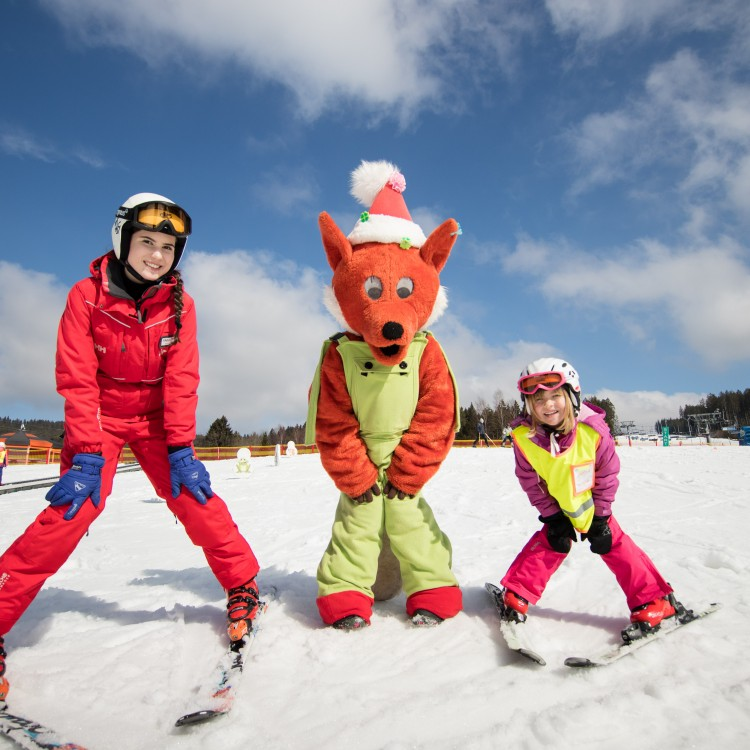
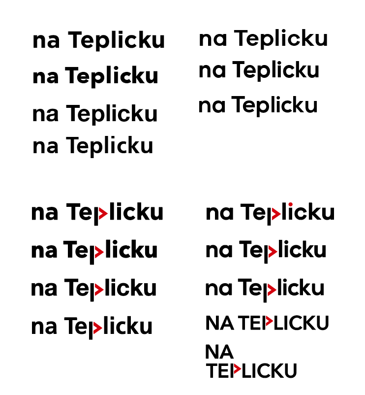
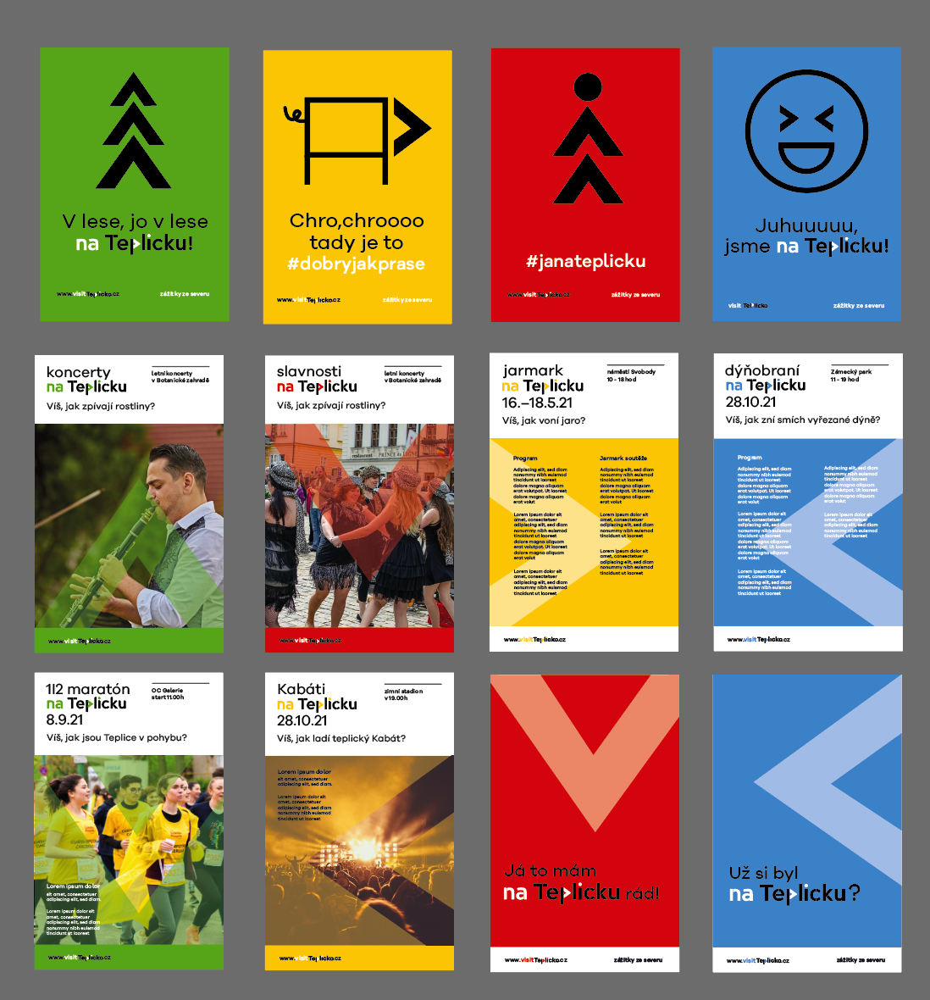
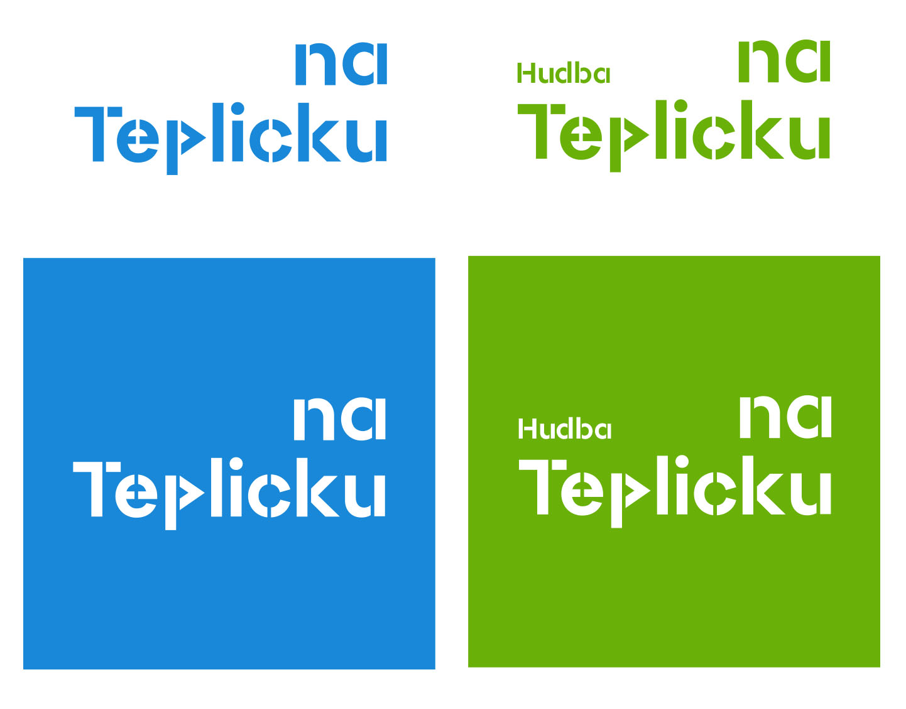
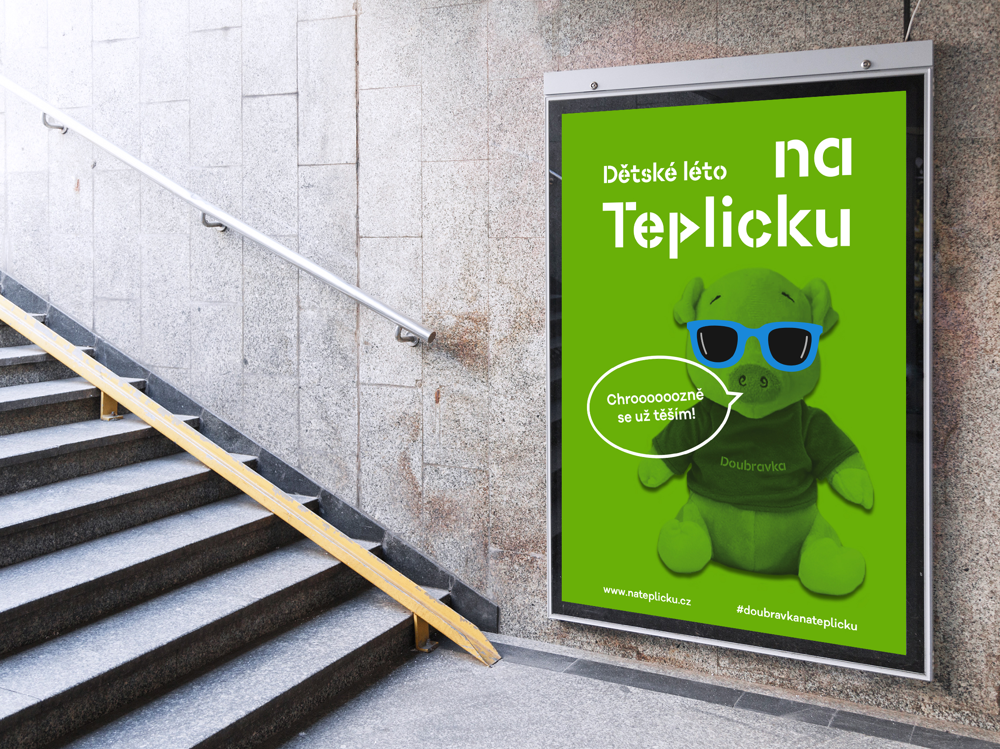
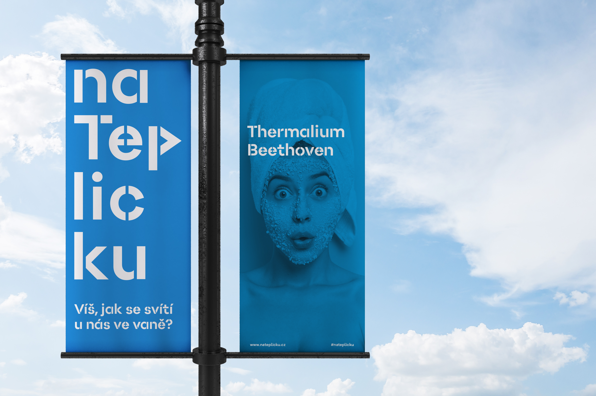
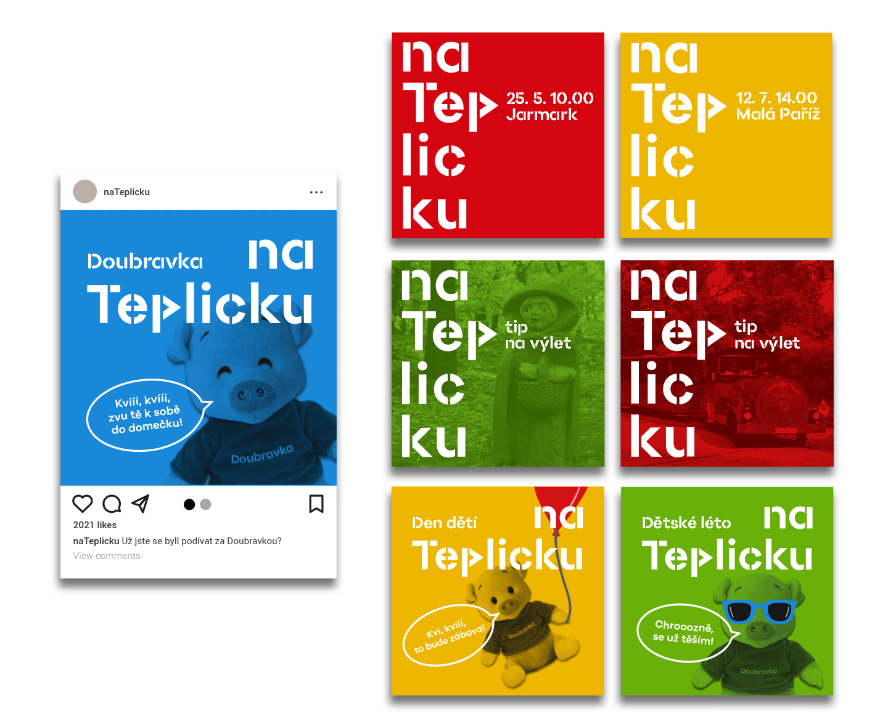
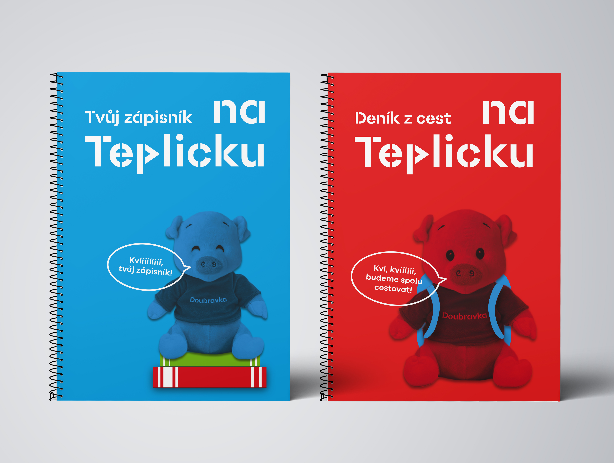
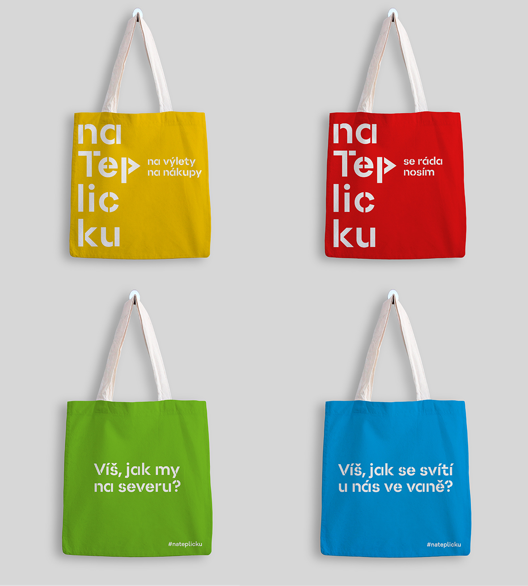

# The story of my bachelor thesis

### Abstract
This bachelor thesis deals with the problem of a missing visual presentation and marketing communication of the tourist area Teplicko. The thesis focuses on designing new means of communication that could solve current issues of this location. The theoretical part defines the meaning of corporate identity and its relationship to image, a brand as a sign of society, describes forms of marketing communication, preparation of advertising campaign, and finally, types of mass media. In the practical part, the author analyzes the Teplicko area in detail using marketing tools and from interviews provided by the co-founder of the tourist center VisitTeplice and deputy secretary of the Tourism and Spa Commission of the Ústí Region. The work identifies positive and negative aspects and subsequently offers new communication solutions. The author plans to introduce the concept to the tourist center and establish future cooperation with them.

#### Keywords:

Visual communication, marketing communication, brand, graphic design, media design, identity, visual style

### The story – How it all started
I always like traveling around the Czech Republic. Since I was a kid, my parents and I visited lots of castles and chateaus. And we discovered the beauty of our country. When Mr. Jelínek, co-founder of the tourist center VisitTeplice, approached me and asked me if I would like to create a new visual style and marketing communication for the tourist area Teplicko. I said definitely yes and chose this theme for my bachelor thesis. 

### Teplicko
I have a very positive relationship with the city of Teplice because I studied at High school (there is a lot of my friends), and a majority of my family live here as my brother with family, my grandparents.

This destination is a beautiful tourist spot with a rich history, a range of cultural monuments, relaxation places as parks, gardens, and a beautiful natural environment with a range of forests and mountain peaks. Teplice provides a complex of spa houses with thermal springs. This spa is the oldest in Bohemia. You can also visit the Regional Museum located in the castle, Krušnohorská Theatre with excellent acoustics and several restaurants and cafes. This area also offers unforgettable views of the Czech Central Mountains from the tops of Doubravka, Milešovky even from the longest funicular railway in Eastern Europe on the Mosquito Whirlpool. There are also former quarries located in Teplicko, which are now flooded after reclamation and are used recreational sites during the summer months. In winter, there are ski slopes or modified cross-country trails. Every summer Sunday, Teplice is still called Little Paris, as a music festival is being held in this honor in Castle Park. Important events also include the traditional annual start of the spa season on the last weekend of May. The tourist area of Tepliceko is there for all ages: juveniles, families with children, and older age groups.

I believe that the tourist area of Teplice has great potential to become a newly popular destination in this region. With my output, I would like to achieve a real use, which will help to solve the absence of visually and marketing young communication of this region with hitherto fully untapped tourist potential.

### History of Teplicko
The town of Teplice is located in the north of the Czech Republic, between the beauties of the Czech Central Mountains and the Ore Mountains. It is also perched close to the border. So this place has become a great link with Germany. That is why trade routes have led here since ancient times. They can therefore owe their development to the blossoming trade, mining, and healing springs. These warm currents also gave a name of Teplice themselves, whose origin is told by the legend of the Rule, when in 762 thermal resources were discovered.

#### Famous personalities
In the past Teplice, also nicknamed Little Paris, was very popular with well-known personalities. The monarchs, writers, and composers visited the city. One of them, for example, was Queen Judith, who had the already mentioned monastery of St. John the Crucible, and she is buried here. Tsar Peter I of Russia also visited the city. The world traveler Giacoma Casanova lived in the nearby Spiritual Castle for 13 years. The writer J.W. Goethe also spent his stay at the spa or the composer Ludwig van Beethoven, who treated his hearing loss at the spa and reportedly worked on the ninth symphony. According to him, there is also a named spa house Beethoven, where you can visit his room in which he stayed in Teplice. Furthermore, the Austrian Empress Elizabeth of Bavaria, called Sissi, chose the place of Teplice for spa purposes.

### Inspiration first
First, I create research on tourist areas in the Czech Republic. Their visual presentation, marketing communication, and online messages via social networks as Instagram or Facebook. I am interested in the communication of Lipno nad Vltavou. They have their mascot (Mr. Fox) that represented Lipno and lures new tourists, especially families with kids. 

Next, that intrigued me is Znojmo city. They have good communication via Instagram. They share posts as reporting from the city. It makes a positive vibe for followings because they are quick information and can become a part of Znojmos communication.

### First drafts
#### The logo
From the beginning, I tried several types and cuts of the font, but in the end, we chose the stencil font that best-described tourism and its paths.

#### Posters
Here, I tried to highlight the arrow, which is also shown in the logo. And I also worked with photos, which I also covered with an arrow. However, we agreed with the professor that the symbol of direction is not the essential element and that I should focus more on photographs and interestingly edit them. That's why I then chose the monochrome color of the photos, which attract much better attention and mark tourism with their color.

### Design of logo
I called the tourist area Teplicko in marketing and visual communication „in Teplicko.“ This name refers to activities, that happen in Teplice, and the tourist can experience them here. The main principle of the proposed logo is the representation of hiking paths using stencil fonts, which I designed myself. It also contains an arrow representing the direction of indicators encountered in different ways. In the visual style, I have chosen a typical color spectrum (blue, green, red, yellow), which we know from tourist signs and attract our attention well.

I have created two variations of the logo.

- The first variant is more decent, adapted for the older generation because of its better readability. The application is mainly on posters, which serve the older age group mentioned above, which does not use social networks to a large extent.

- The other variant is more creative, lively, and dynamic than the previous proposal. In communication, it focuses on the younger generation, whom it can address with its playfulness. There is a highlighted word pulse that refers to warm springs in Teplice, and at the same time, the arrow in the logo points to activities, that are happening in the area. It is used mainly on social networks and in merchandising.

### Communication
#### The specific form of language
For the tourist region Teplicko, I have created a specific form of communication, which will be its signature, and is written into the visual style. This language is based on humorous and absurd questions about the places and attractions visited here, which amuse and generate interest in finding out more.

#### Mascot
One of the most important communication channels for attracting new tourists (families with children). I created the soft toy mascot Pig Doubravka, based on Doubravka Mountain, where he lives, which is associated with the rumor of finding thermal springs. The pig has an appearance, changes clothes or accessories according to the situation, character, and specific form of language for communication with children.

### Posters
The prints, that can we see on the street every day are called Out of Home. I deal here with the application for posters, banners, and billboards. I've divided these posters into three types of communication.

- Image posters
- Information posters
- Two posters - – question and answer 

### Online
In the context of online communication, I focus primarily on the target group, which is the young generation and families with children through the social networks Instagram and Facebook.

I have identified several communication planes that present the tourist area Tepliceko as an interesting place for holidays even for young age groups. I also created the hashtag #nateplicku, which is typical of Instagram, under which people can add posts and show off their photos.

- Funny posts
- Posts of events
- Posts - Tips for trips
- Posts of Pig Doubravka
- Filter of Doubravka on Instagram

 

### Merchadising
I have designed several gift items for the right tourist enthusiasts, that they can take home as souvenirs from their vacation in the north of Bohemia. The visual style is written into them to match the overall design of the tourist area, and these gifts have become another distinguishing signal of Teplicko.

